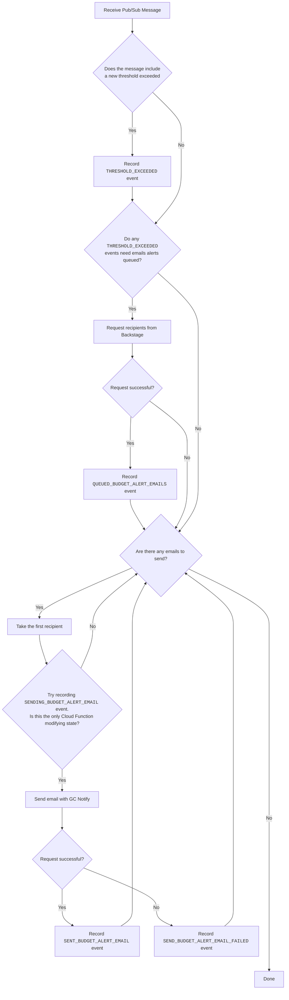

# Budget Alerts

This directory contains a Cloud Function that sends budget alert emails using GC Notify.

## Environment Variables

Ensure the following environment variables are set:

| Environment Variable                  | Description                                                               |
| ------------------------------------- | ------------------------------------------------------------------------- |
| `BACKSTAGE_URI`                       | The base URL for the Backstage platform.                                  |
| `BACKSTAGE_BUDGET_ALERT_EVENTS_TOKEN` | The static API key for authenticating requests to the Backstage platform. |
| `GC_NOTIFY_URI`                       | The base URL for the GC Notify service.                                   |
| `GC_NOTIFY_API_KEY`                   | The API key for authenticating with the GC Notify service.                |
| `GC_NOTIFY_ALERT_TEMPLATE_ID`         | The template ID for budget alert notifications.                           |
| `GC_NOTIFY_OVER_BUDGET_TEMPLATE_ID`   | The template ID for over budget notifications.                            |
| `BUDGET_ALERTS_STORAGE_BUCKET`        | The Bucket name where the event logs are saved.                           |

## Local Development

To serve the Cloud Function locally:

- Install Node.js v20
- Install the npm packages:
  ```sh
  npm install
  ```
- Start local development:
  ```sh
  task budget-alerts:dev
  ```

## Testing

There are unit tests defined in [**src/**tests**/**](./src/__tests__/).

To ensure the Cloud Function works as expected, it’s important to run tests both locally and in the cloud environment. Here are the steps:

1. Start the local Pub/Sub emulator:
   ```sh
   task budget-alerts:emulator
   ```
2. Register the topic and subscription:
   ```sh
   task budget-alerts:register
   ```
3. Publish a test message using the predefined message in `message.json`:
   ```sh
   task budget-alerts:publish
   ```

### Integration Testing

1. Deploy the function to a test environment.
2. Trigger the function with sample Pub/Sub messages and verify the email notifications are sent correctly.

## Troubleshooting

- **Failed to fetch project data**: Ensure the Backstage platform is accessible and the API key is correct.
- **Unable to send email notifications**: Verify the GC Notify API key and template IDs are correct.
- **Pub/Sub emulator issues**: Ensure the emulator is running and the topic and subscription are correctly registered.

## Deployment

Deployment has not been automated yet. Follow [the documentation](https://cloud.google.com/functions/docs/deploy#from-local-machine) to deploy from your local machine:

```
gcloud functions deploy science_portal_budget_alert_function \
  --region=northamerica-northeast1 \
  --runtime=nodejs20 \
  --source=./ \
  --trigger-topic=science_portal_budget_alert
```

## Design

Google Cloud's built-in [budget alerts](https://cloud.google.com/billing/docs/how-to/budgets) don't meet the project requirements. These requirements demand a different approach:

- Send an email to more than five recipients
- Send a customized email when the project is over budget
- Send a customized email for epidemiologists who are not familiar with managing resources on Google Cloud

Given the time available during the engagement, a minimal viable solution has been implemented to send email notifications. The Cloud Function responds to budget threshold alerts and periodic status update messages sent to a pub/sub topic. The Cloud Function identifies when a threshold is crossed, who to notify, and sends emails using GC Notify. The current solution uses an event log saved in Google Cloud Storage with some support for resiliency and race condition avoidance.

The following flow chart demonstrates how the event log is used to determine what actions are required:



### Dependencies

This design depends on:

- Budget alerts being published to a Pub/Sub topic
- Backstage must be accessible using the configured base URL and access token
- GC Notify must be configured to with a working base URL, API Key, and template IDs.
- The configured Bucket must exist
